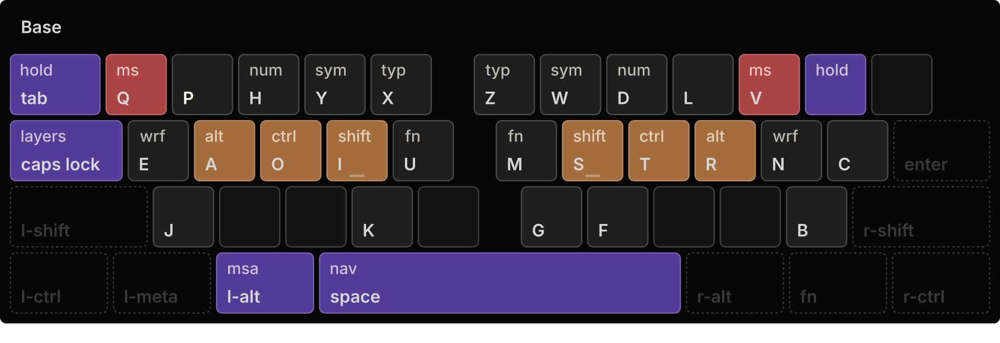
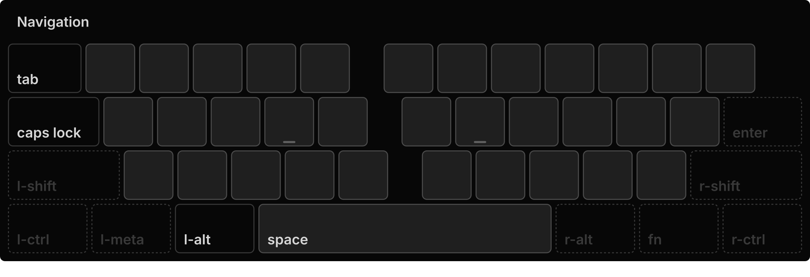
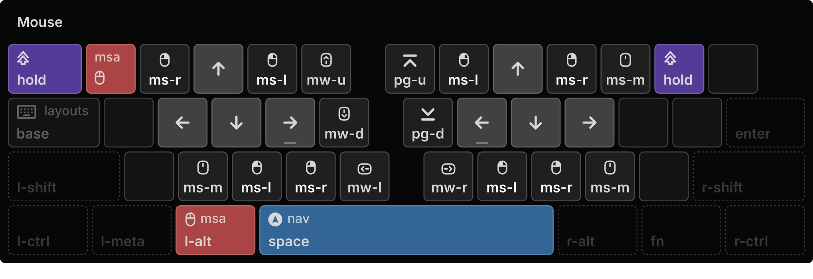
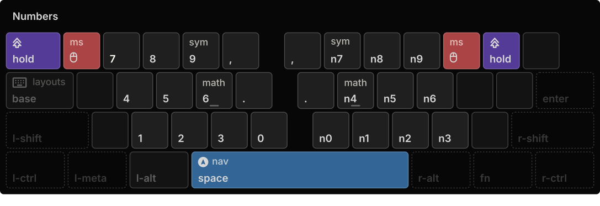
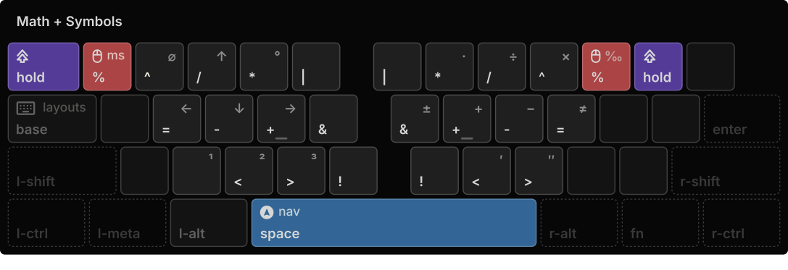

<h3 id="kanata-config" align="center">
  <br>
    
  <br>
  Kanata Config
  <br>
</h1>

##

<div align="center">
  <p>My personal kanata configuration.</p>
</div>


## Table of contents

- [Kanata Config](#kanata-config)
  - [Table of contents](#table-of-contents)
  - [Overview](#overview)
  - [Features](#features)
  - [Layouts](#layouts)
  - [Getting started](#getting-started)
    - [Prerequisites](#prerequisites)
    - [Build Kanata](#build-kanata)
    - [Installation](#installation)
    - [Running](#running)
  - [Inspiration](#inspiration)
  - [License](#license)

## Overview

My personal kanata configuration with home-row.

My personal kanata configuration for non-qmk / non-zmk keyboard.













## Features

- Home-Row

## Layouts

- qPhyx-lat
- qPhyx-cyr

## Getting started

### Prerequisites

- Kanata v1.9.0 or greater

<h3 id="build-kanata">Build Kanata</h3>

Build Kanata with the required feature flags:

```shell
git clone https://github.com/jtroo/kanata.git
cd kanata
cargo build --release --features win_manifest,gui,cmd,win_sendinput_send_scancodes,win_llhook_read_scancodes
```

<h3 id="installation">Installation</h3>

```shell
git clone https://github.com/sjlex/kanata-config.git
```

<h3 id="running">Running</h3>

Run the configuration with Kanata GUI:

  - Launch with the highest privileges and at high priority!

```shell
target\release\kanata.exe --quiet --nodelay --cfg "main.kbd"
```

## Inspiration

- [qPhyx Layout](https://github.com/uqqu/layout)

## License

[MIT License](LICENSE)
